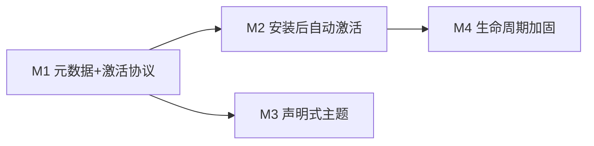

# GUI 插件市场开发计划

> 状态:二审修复中 · 分支 `feat/plugin-marketplace`(monorepo 与本仓库同名分支)
> 二审日期:2026-08-22

## 目标

在现有 OMP 插件系统之上,把 GUI 已有的技术型 marketplace 管理器产品化为插件市场:
**打开 → 浏览(完整元数据)→ 选择 → 安装(信任确认)→ 自动激活(空闲重启)→ 立即可用**。
另支持声明式 GUI 主题 Token 插件。

不引入第二套插件运行时:GUI 保持静态安全宿主(`contextIsolation` + `sandbox` + `script-src 'self'`),
插件逻辑全部在 sidecar(`resources/omp` 运行时动态加载 `~/.omp/plugins` 与项目插件根)。

## 范围

**做**:用户配置 marketplace、catalog 元数据透传、激活协议(live / restart-required)、
空闲自动重启 + 回合完成后激活、声明式主题 Token、可执行插件安装信任确认。

**不做(v1)**:不存在的官方 catalog 预置、未保留旧 cache 的版本回滚、
任意前端插件宿主(iframe/React)、npm catalog source、细粒度权限系统、
评分/截图、多窗口同步重启、跨市场全局搜索、过期版本提醒。

## 设计决策

| # | 决策 | 依据 |
|---|---|---|
| D1 | 激活判定比较变更前后**实际会加载**的插件集合;任一侧含 `extensions`/`tools`/`hooks` → `restart-required` | 统一覆盖安装、升级、卸载、启停、feature 变更和 project/user shadow 切换 |
| D2 | 重启绑定发起 mutation 的 tab,校验也走 tab-targeted RPC | renderer 选中 tab 与 main 已路由 tab 存在异步间隙 |
| D3 | 插件主题 = 复用 agent-theme overlay 机制,仅允许 `TRANSCRIPT_OVERLAY_VARS` 子集;agent 冲突获胜 | 单一 overlay writer,不引入第二套主题路径 |
| D4 | 可执行插件禁用、卸载同样 `restart-required` | 已加载实例无法由 hot reload 卸载 |

## 里程碑

---

## M1 — 元数据与激活协议

### P1 Catalog 元数据透传 — backend, S ✅

catalog 的 author/license/repository/homepage/category/tags 已存在
(`marketplace/types.ts` `MarketplacePluginEntry`),但 `applyRpcMarketplaceAction`
的 `list_available` 原本只转发 name/description/version/installed。

- `rpc-types.ts` `RpcMarketplacePluginInfo` 加可选
  `author?/license?/repository?/homepage?/category?/tags?`;`rpc-marketplace.ts` 转发
- 手工镜像 `packages/gui/src/shared/rpc-types.ts` 同名接口
- 验收:契约测试经真实 RPC(fixture marketplace)断言元数据字段 ✅

### P2 GUI 插件卡片增强 — gui, S ✅

**审计修正**:marketplace 浏览没有详情抽屉(`PluginDetailDrawer` 是已安装插件的
设置/功能抽屉),P2 仅增强 `AvailablePluginRow`(`MarketplacesSection.tsx`)。

- 行内第二行:author · license · category · #tags;repository/homepage 可点击
  (经 `window.omp.system.openExternal`)
- i18n key 同步加 `en.ts` + `zh.ts` ✅

### P3 激活检测 — backend, M ✅

安装/启用/禁用/features/upgrade 变更后,读 cachePath `package.json` 的 `omp ?? pi`
manifest 按 D1 判定:

- `RpcPluginActivation` 类型;`RpcMarketplaceActionResult`/`RpcPluginSetEnabledResult`/
  `RpcPluginMutationResult` 加 `activation?` 字段
- mutation 前后调用 runtime loader 获取当前 cwd 的有效插件集合;
  比较 path/version/features,任一变更侧含 executable entry 即 restart-required
- 覆盖 install/upgrade/uninstall、enable/disable、features、project/user shadow 切换
- 验收:资源插件 live;executable 的加载与卸载均 restart-required ✅

### P4 安装信任确认 — gui, S ✅

**实现偏差(实测修正)**:catalog wire 不携带 omp manifest,GUI 无法预装判定
可执行性——改为**所有安装都确认**(行内 confirm swap,与 removeMarketplace 同模式,
元数据已在行内可见)。

- `MarketplacesSection.tsx`:runPluginAction 门控 install → confirmInstall 状态;
  AvailablePluginRow 渲染 confirm/cancel swap + "完整本机权限"警示 hint
- 命令面板 `marketplace install` 仅打开该面板,不保留绕过确认的直接 RPC 路径
- 验收:vitest 覆盖 confirm/cancel/直接装 ✅(M1 里程碑 GUI 全量 903 tests 绿)

---

### P6 空闲自动重启 — gui, M ✅

- `pendingByTab` 按 tab+session 保存多个待激活目标,同一 tab 只重启一次
- mutation 起点捕获 tab/session;重启 payload 和 `get_plugins` 校验均显式指定 origin tab
- streaming/compacting/session switch 时排队;回合结束或 route settled 后执行
- MarketplaceCard、PluginsTab、PluginDetailDrawer、命令入口统一消费 activation

### P7 重启后状态校验 — both, S ✅

- 重启后经 `commandForTab(originTab)` 轮询 `get_plugins`,分别验证 enabled/disabled 预期状态
- 成功/失败 toast;校验不再依赖当前选中 tab 的全局 RPC 路由

### P8 manifest + RPC — backend, S ✅

- `PluginManifest.gui?: { theme?: string }`(相对路径,JSON token map)
- 新 RPC `get_gui_themes` → `RpcGuiThemesResult { themes: [{ id, tokens }] }`
- `buildRpcGuiThemes` 复用 runtime loader 的有效插件集合,自然遵守 project override 与 shadow
- 非字符串/越界/坏 JSON asset 仅跳过对应插件
- GUI:命令 union + preload `getGuiThemes` + OmpApi + 镜像接口

### P9 GUI 校验与应用 — gui, M ✅

- `validatePluginThemeTokens`:key ⊆ `TRANSCRIPT_OVERLAY_VARS`;正则收窄形状后再经
  `CSS.supports("color", value)` 做浏览器真值校验
- themes.ts 单一 `writeOverlay()`:plugin 层在 agent 层之下(agent 冲突获胜)
- App 同时监听 origin tab route settled 与 sidecar ready/running,顺序任意均刷新主题
- 验收:接受/拒绝/写入/清除/project disable/坏 asset 契约测试 ✅

---

## M4 — 文档

### P11 插件作者文档 — docs, S ✅

文档位于 monorepo `docs/marketplace.md`:manifest 字段、激活语义、
`gui.theme` 规范、vendored 依赖要求。

---

## 仓库与发布流程

| 改动 | 提交位置 | 推送 |
|---|---|---|
| P1/P3/P7(backend)/P8 | monorepo 根(`feat/plugin-marketplace`) | `origin`(nornzach/oh-my-pi fork) |
| P2/P4/P6/P7(gui)/P9 | 本仓库(`feat/plugin-marketplace`) | `origin/main`(nornzach/oh-my-pi-gui) |

- wire 类型改动 = 双侧手改 + `bun run gen:types` 漂移检查(**审计确认**:gen-types 是检查器非生成器)
- 发版前:`sync-upstream.sh` → `build:omp` → GUI 冒烟(ready、get_settings、
  添加一个用户提供的 fixture marketplace 并走完整确认/激活链)

## 测试规范(遵循 AGENTS.md)

- backend:契约测试打在 resolver/RPC 层;临时 HOME fixture,不碰真实 `~/.omp`
- gui:linkedom harness;zustand 用 `reset()`;禁 `mock.module`
- 各 phase 验收即回归用例;禁止 source-grep 测试

## 风险

| 风险 | 缓解 |
|---|---|
| 重启杀掉进行中回合 | busy 守卫 + agent_end 延迟激活,绝不静默中断 |
| 多窗口插件状态漂移 | v1 文档化提示;pool 级 restart 进 Backlog |
| 插件主题伪装 UI | 仅 transcript token 子集,chrome blocklist 不变 |
| vendored 依赖膨胀 | 作者文档要求 + catalog 审核检查 |

## Backlog(非 v1)

- 跨市场全局插件搜索
- 已装插件过期版本提醒(只提示,不自动升级)
- pool 级多窗口同步重启
- 插件市场详情页(截图、README 渲染)
- npm catalog source
