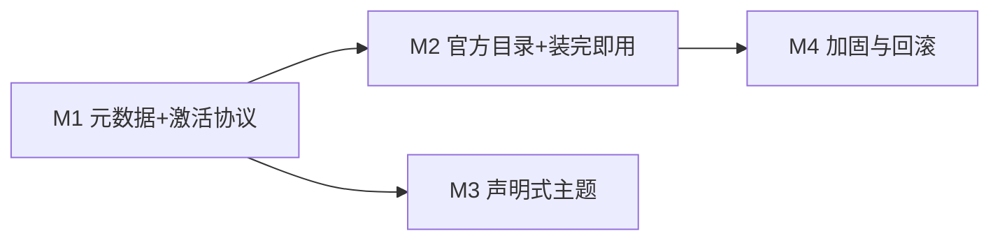

# GUI 插件市场开发计划

> 状态:P1 进行中 · 分支 `feat/plugin-marketplace`(monorepo 与本仓库同名分支)
> 审计日期:2026-08-21(事实核查通过,含修正,见各条目"审计"标注)

## 目标

在现有 OMP 插件系统之上,把 GUI 已有的技术型 marketplace 管理器产品化为插件市场:
**打开 → 浏览(完整元数据)→ 选择 → 安装(信任确认)→ 自动激活(空闲重启)→ 立即可用**。
另支持声明式 GUI 主题 Token 插件。

不引入第二套插件运行时:GUI 保持静态安全宿主(`contextIsolation` + `sandbox` + `script-src 'self'`),
插件逻辑全部在 sidecar(`resources/omp` 运行时动态加载 `~/.omp/plugins` 与项目插件根)。

## 范围

**做**:官方目录预置、catalog 元数据透传、激活协议(live / restart-required)、
空闲自动重启 + 回合完成后激活、重启后加载校验、声明式主题 Token、
可执行插件安装信任确认、升级失败手动回滚。

**不做(v1)**:任意前端插件宿主(iframe/React)、npm catalog source
(`source-resolver.ts` 明确未实现)、细粒度权限系统、评分/截图、
多窗口同步重启、跨市场全局搜索、过期版本提醒(后三项进 Backlog)。

## 设计决策

| # | 决策 | 依据 |
|---|---|---|
| D1 | 激活判定:manifest 的 `extensions`/`tools`/`hooks` 基础条目**或**默认启用 feature 的对应条目任一非空 → `restart-required`;仅 `commands`/纯资源 → `live` | 扩展工厂仅在 session 创建时加载(`sdk.ts` loadExtensions);`applyRpcReloadPlugins` 只热加载 skills/commands/MCP |
| D2 | 官方 catalog:registry 文件缺失时种子化,URL 为模块常量 | 零配置首跑;幂等(存在任何 registry 即不覆盖)。**审计**:settings 覆盖砍掉(YAGNI);官方仓库 URL 为开放决策,占位 `nornzach/omp-plugins` |
| D3 | v1 重启范围 = 当前 tab 的 sidecar,`sidecar.restart(sessionPath)` 精确恢复;其他窗口显示"重启后生效" | **审计确认**:tabs store 每 tab 持有 `sessionPath`(`tabs.ts:88`);pool 级重启进 Backlog |
| D4 | 插件主题 = 复用 agent-theme overlay 机制,仅允许 `TRANSCRIPT_OVERLAY_VARS` 子集;与 agent 主题并存时 **agent 优先**,合并后单次写入 | `themes.ts` 已有 overlay + chrome blocklist;零新渲染路径。**审计**:明确合并顺序,避免两个写者互相 clobber |
| D5 | 官方插件仅 git source + 固定 commit SHA;依赖必须 vendored | sidecar 安装无 `bun install` 步骤 |
| D6 | 回滚 = 升级保留旧 cache(ref-count 清理已保证)+ 手动"恢复上一版" | 不做自动回滚,避免误判 |
| D7 | 可执行插件**禁用**同样 `restart-required`(卸载已加载实例);卸载动作本身 `live`,文案注明已加载实例随下次重启消失 | **审计修正**:原计划只写了启用方向 |

## 里程碑

---

## M1 — 元数据与激活协议

### P1 Catalog 元数据透传 — backend, S ✅

catalog 的 author/license/repository/homepage/category/tags 已存在
(`marketplace/types.ts` `MarketplacePluginEntry`),但 `applyRpcMarketplaceAction`
的 `list_available` 原本只转发 name/description/version/installed。

- `rpc-types.ts` `RpcMarketplacePluginInfo` 加可选
  `author?/license?/repository?/homepage?/category?/tags?`;`rpc-marketplace.ts` 转发
- 手工镜像 `packages/gui/src/shared/rpc-types.ts` 同名接口
- 验收:契约测试经真实 RPC(fixture marketplace)断言元数据字段 ✅

### P2 GUI 插件卡片增强 — gui, S ✅

**审计修正**:marketplace 浏览没有详情抽屉(`PluginDetailDrawer` 是已安装插件的
设置/功能抽屉),P2 仅增强 `AvailablePluginRow`(`MarketplacesSection.tsx`)。

- 行内第二行:author · license · category · #tags;repository/homepage 可点击
  (经 `window.omp.system.openExternal`)
- i18n key 同步加 `en.ts` + `zh.ts` ✅

### P3 激活检测 — backend, M ✅

安装/启用/禁用/features/upgrade 变更后,读 cachePath `package.json` 的 `omp ?? pi`
manifest 按 D1 判定:

- `RpcPluginActivation` 类型;`RpcMarketplaceActionResult`/`RpcPluginSetEnabledResult`/
  `RpcPluginMutationResult` 加 `activation?` 字段
- `pluginRequiresRestart(manifest, enabledFeatures)` + `installedPluginActivation()`
  放 `rpc-marketplace.ts` 导出,`rpc-actions.ts`(enable,双通道)与
  `rpc-plugins.ts`(features)复用;禁用方向同样 restart-required
- 验收:executable/resource-only/feature-scoped 三类 fixture 契约测试 ✅
  (注:测试隔离用 barrel 路径 spy,非 homedir——DirResolver 单例不响应 homedir mock)

### P4 安装信任确认 — gui, S ✅

**实现偏差(实测修正)**:catalog wire 不携带 omp manifest,GUI 无法预装判定
可执行性——改为**所有安装都确认**(行内 confirm swap,与 removeMarketplace 同模式,
元数据已在行内可见)。

- `MarketplacesSection.tsx`:runPluginAction 门控 install → confirmInstall 状态;
  AvailablePluginRow 渲染 confirm/cancel swap + "完整本机权限"警示 hint
- 验收:vitest 覆盖 confirm/cancel/直接装 ✅(M1 里程碑 GUI 全量 903 tests 绿)

---

## M2 — 官方目录与"装完即用"

### P5 官方 catalog 种子化 — backend + 治理, S ✅

- `MarketplaceManagerOptions.seedOfficialMarketplace?: boolean`(生产工厂 opt-in,测试不传);
  `listMarketplaces()` 发现 registry 文件**缺失**时写入 official entry
  (`OFFICIAL_MARKETPLACE_NAME/SOURCE` 常量,占位 `nornzach/omp-plugins`)
- 纯 registry 写入,无网络请求——离线首跑降级为"未获取"卡片;已存在 registry(含空)不覆盖
- 验收:seeding 幂等/不覆盖/无 flag 不种子 三契约测试 ✅
  (官方 catalog 仓库本体待建:结构见 P11 模板)

### P6 空闲自动重启 — gui, M ✅

**实现偏差**:持久横幅改为 toast(info)+ 自动重启——信息不重复,少一个常驻 surface。

- `stores/plugin-activation.ts`(pendingId)+ `lib/plugin-activation.ts`
  (handlePluginActivation / restartForActivation / watchPluginActivation)
- 空闲 → `sidecar.restart(sessionFile)` 立即;busy → 队列,App 挂
  `useSessionStore.subscribe` watcher,回合结束自动重启(D3:仅当前 tab)
- 入口:MarketplaceCard executePluginAction + `/marketplace` 命令路径

### P7 重启后加载校验 — both, S ✅

- 重启后轮询 `get_plugins`(默认 20×400ms)确认插件存在且 enabled;
  成功/失败 toast,`restartForActivation` 返回 "restarted"|"missing"|undefined
- `extension_error` frame 转发链路已存在(sidecar.ts→IPC→renderer),暂不重复接线

### P8 manifest + RPC — backend, S ✅

- `PluginManifest.gui?: { theme?: string }`(相对路径,JSON token map)
- 新 RPC `get_gui_themes` → `RpcGuiThemesResult { themes: [{ id, tokens }] }`;
  `buildRpcGuiThemes`(rpc-plugins.ts)双通道收集(npm + marketplace,镜像
  buildRpcPluginsResult),路径越界防护(pathIsWithin),非字符串值丢弃,
  坏 asset 跳过不失败
- GUI:命令 union + preload `getGuiThemes` + OmpApi + 镜像接口
- 验收:2 契约测试(enabled 收集/disabled 跳过)✅

### P9 GUI 校验与应用 — gui, M ✅

- `validatePluginThemeTokens`:key ⊆ TRANSCRIPT_OVERLAY_VARS、value 匹配
  颜色形状(hex/rgb/hsl/oklch/lab/color-mix/var());逐 key 拒绝,单个坏 token
  不拖垮整个主题;chrome token 按构造不可达(overlay map 无 chrome 条目)
- themes.ts overlay 写入重构为单一 `writeOverlay()`:plugin 层叠在 agent 层
  之下(agent 冲突获胜,D4),合并后单次写 inline vars;`overlayIntact` 探针
  覆盖合并层
- `refreshPluginThemes()`:App 启动 + 激活重启验证成功后调用
- 验收:5 契约测试(接受/拒绝/写入/清除/全拒)✅(M3 GUI 全量 916 tests 绿)

---

## M4 — 加固

### P10 升级失败恢复 — gui + backend, S ✅(降级实现)

**降级理由(审计确认)**:installPlugin 升级时删除旧 cache(ref-count 只保护
跨引用,不保留旧版本);registry 为 Claude 兼容格式(version: 2 强校验),
加字段有兼容风险——"恢复上一版本"按钮不可实现。

实际恢复路径(已闭环):
- 激活校验失败(P7)→ 错误 toast 指引"检查或卸载"
- 插件行现有 uninstall / upgrade 操作完成恢复
- 后续增强(Backlog):升级保留上一版 cache + registry 扩展字段

### P11 插件作者文档 — docs, S ✅

**位置偏差**:官方 marketplace 仓库未建,文档落 monorepo `docs/marketplace.md`
("Authoring plugins" 段)——manifest 字段、激活语义、`gui.theme` 规范
(允许 key/value 形状)、vendored 依赖要求、官方 catalog 模板(SHA 固定)。

---

## 仓库与发布流程

| 改动 | 提交位置 | 推送 |
|---|---|---|
| P1/P3/P5/P7(backend)/P8 | monorepo 根(`feat/plugin-marketplace`) | `origin`(nornzach/oh-my-pi fork) |
| P2/P4/P6/P7(gui)/P9/P10 | 本仓库(`feat/plugin-marketplace`) | `origin/main`(nornzach/oh-my-pi-gui) |

- wire 类型改动 = 双侧手改 + `bun run gen:types` 漂移检查(**审计确认**:gen-types 是检查器非生成器)
- 发版前:`sync-upstream.sh` → `build:omp` → GUI 冒烟(ready、get_settings、
  装一个官方插件走完整激活链)

## 测试规范(遵循 AGENTS.md)

- backend:契约测试打在 resolver/RPC 层;临时 HOME fixture,不碰真实 `~/.omp`
- gui:linkedom harness;zustand 用 `reset()`;禁 `mock.module`
- 各 phase 验收即回归用例;禁止 source-grep 测试

## 风险

| 风险 | 缓解 |
|---|---|
| 重启杀掉进行中回合 | busy 守卫 + agent_end 延迟激活,绝不静默中断 |
| 多窗口插件状态漂移 | v1 文档化提示;pool 级 restart 进 Backlog |
| 官方 catalog 供应链 | SHA 固定 + 官方/第三方视觉区分 + 可执行插件安装确认 |
| 插件主题伪装 UI | 仅 transcript token 子集,chrome blocklist 不变 |
| vendored 依赖膨胀 | 作者文档要求 + catalog 审核检查 |

## Backlog(非 v1)

- 跨市场全局插件搜索
- 已装插件过期版本提醒(只提示,不自动升级)
- pool 级多窗口同步重启
- 插件市场详情页(截图、README 渲染)
- npm catalog source
