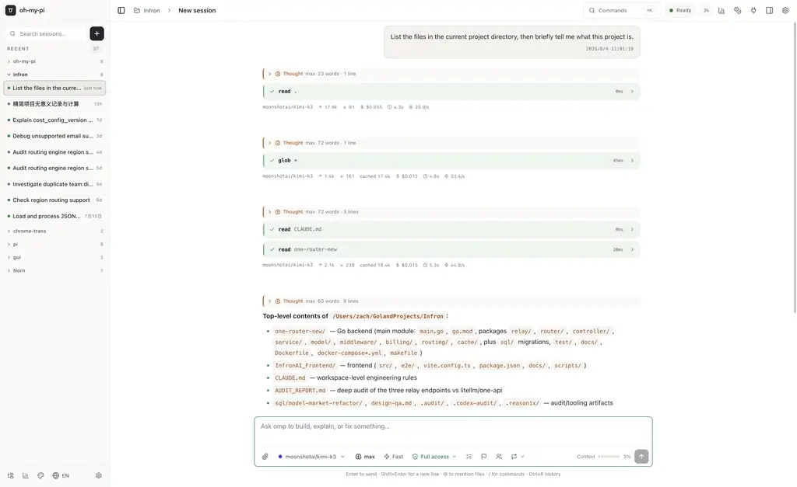
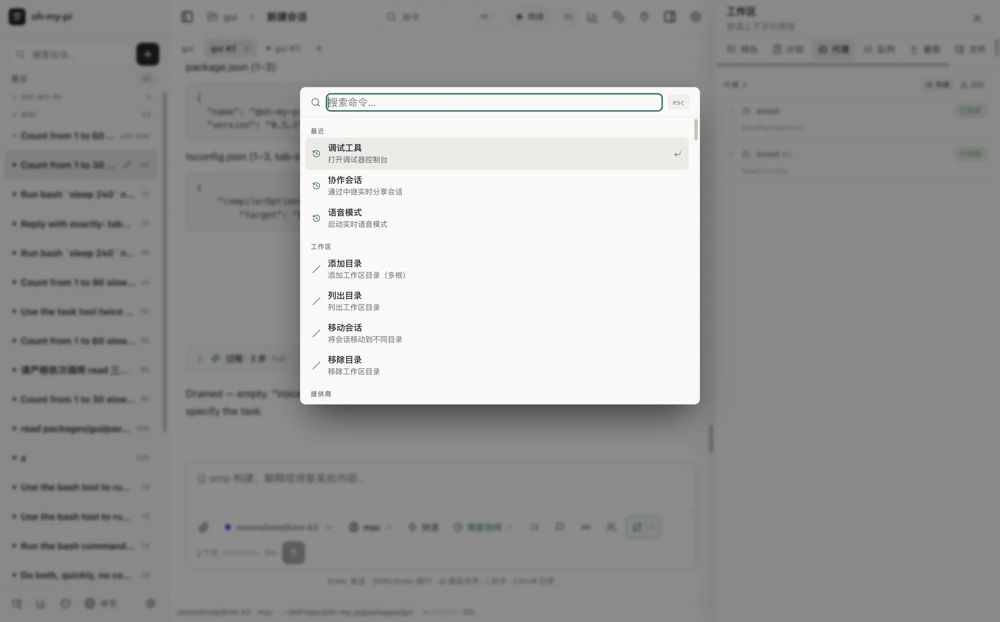
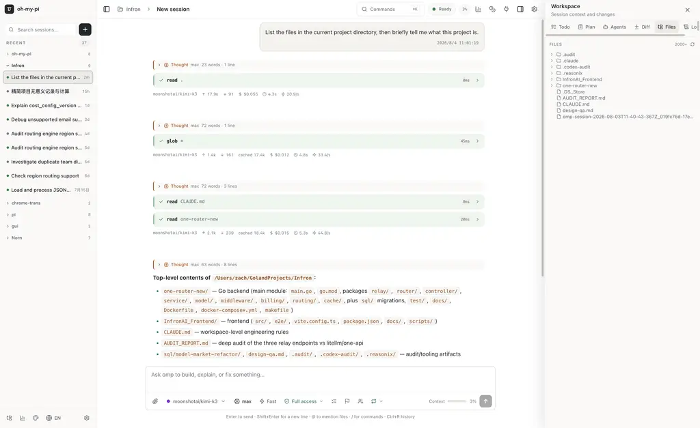
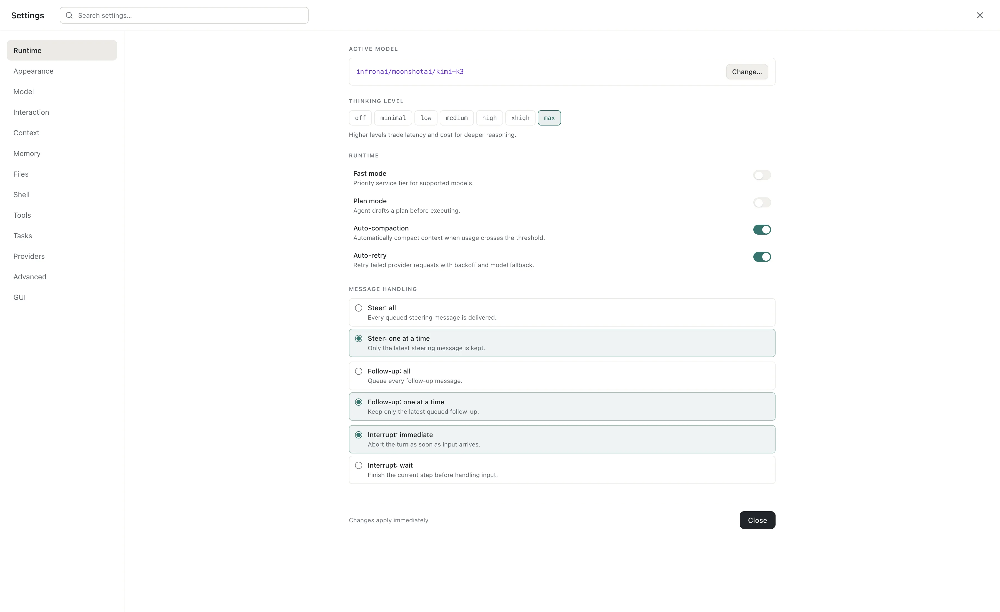
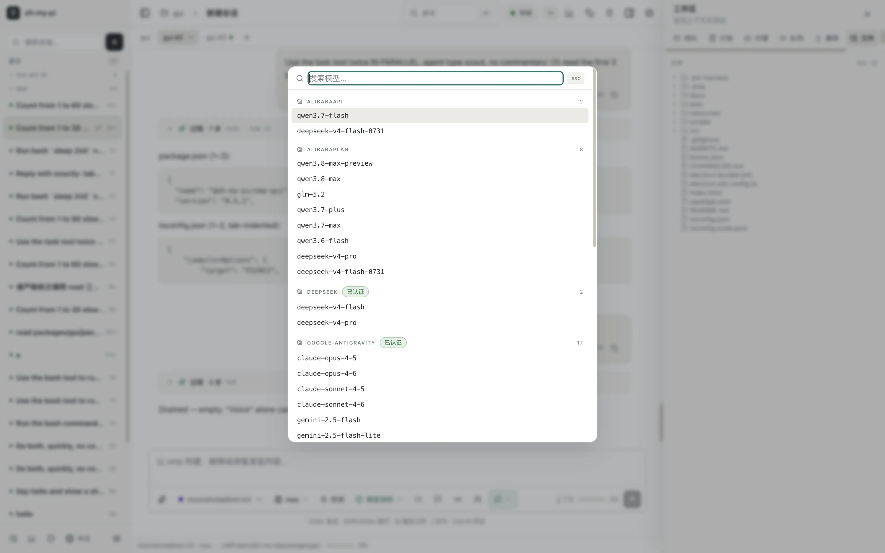
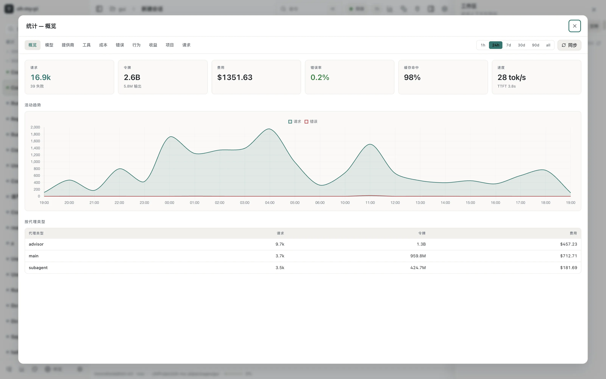
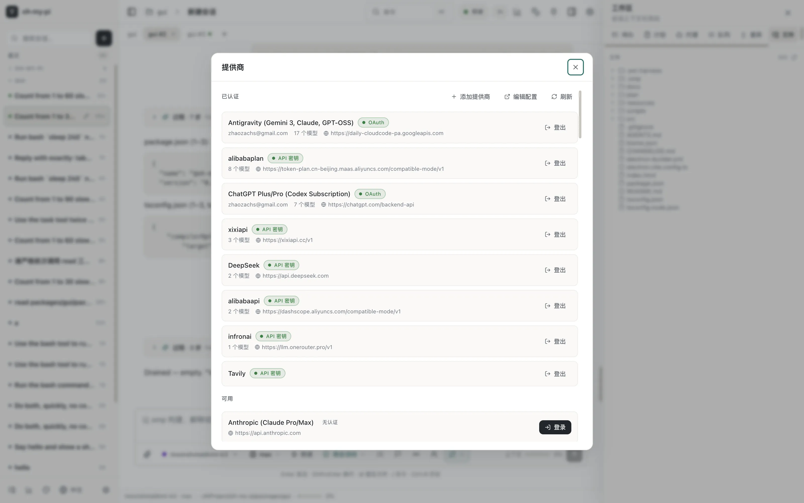

<div align="center">

# omp GUI

**A desktop GUI for the [omp](https://github.com/can1357/oh-my-pi) coding agent.**

Every slash command as a menu · full-fidelity rendering · providers, models & usage in one place.

[English](#english) · [中文](#中文)

</div>

---



<a name="english"></a>
## English

`omp GUI` wraps the omp agent (`omp --mode rpc-ui`) in a fast Electron shell. The agent runs as a bundled sidecar — **no separate omp / bun / Node install is required**; the app ships its own binary and talks to it over a typed NDJSON RPC bridge.

### Highlights

- **Every `/` command, as a menu.** Commands aren't just text you type — they're grouped, searchable menus. Open the **Command Palette (`⌘K`)** for fuzzy access to everything, or browse grouped categories (Workspace, Providers, Model, Session…). Sub-menus, argument prompts, and toggles all run the underlying RPC — never a fake input box.

- **Full-fidelity rendering.** The chat renders what omp's TUI renders: streaming text, collapsible **thinking** blocks, live **tool cards** (bash, edit, read, grep, task, …) with real diffs, markdown, **KaTeX math**, mermaid diagrams, and syntax-highlighted code — streamed token-by-token.

- **Providers & login.** Sign in with OAuth or API keys, add third-party providers, edit `models.json` config, and see auth status at a glance.

- **Model config.** Pick the model, tune the **thinking level**, toggle fast/plan mode, and assign per-role models.

- **Usage & quotas.** A full stats dashboard — requests, tokens, cost, cache-hit, speed, errors, per-agent breakdown — with time ranges and charts.

- **Workspace panels.** Todo, Plan, Subagents, Diff, Files, and Logs in a collapsible side panel, kept in sync with the agent in real time.

- **Sessions.** Search, group, rename, branch, fork/handoff, and resume sessions across projects. Global and per-project history.

- **Parallel, protected sessions.** Open up to 10 windows, each with its own sidecar. Switching away from a busy session offers a new window, explicit abort, or cancel instead of silently killing work.

- **OMP capabilities, not generic toggles.** Settings leads with TTSR, parallel subagents, model roles, Advisor, goal/loop modes, memory, and native tools. Schema-driven controls distinguish live settings from restart-required ones, and full-row switches persist across reconnects.

- **Proxy-aware packaged app.** Finder-launched builds resolve an explicit GUI proxy, inherited proxy variables, or the macOS system proxy for OAuth, streaming, and usage requests.

### Screenshots

| | |
|---|---|
| **Command Palette (`⌘K`)** — every slash command as a grouped, searchable menu |  |
| **Workspace panel** — Todo / Plan / Agents / Diff / Files / Logs beside the chat |  |
| **Settings** — runtime, model, context, tools, providers, GUI, all in one window |  |
| **Model picker** — grouped by provider with auth status |  |
| **Usage & stats** — requests, tokens, cost, cache-hit, speed over time |  |
| **Providers & login** — OAuth / API-key sign-in, third-party providers |  |

### Install

Current release: [**v0.3.1**](https://github.com/nornzach/oh-my-pi-gui/releases/tag/v0.3.1)

- **Apple Silicon (M1/M2/M3/M4):** `omp-0.3.1-arm64.dmg`
- **Intel:** `omp-0.3.1.dmg`

Open the `.dmg` and drag **omp** into **Applications**. The build is unsigned, so on first launch macOS may block it: **right-click → Open** (or *System Settings → Privacy & Security → Open Anyway*).

### Repository layout (read this first)

This repo ([`nornzach/oh-my-pi-gui`](https://github.com/nornzach/oh-my-pi-gui)) is the **only** commit/release target for the GUI — but it does **not** contain the agent source. The agent is compiled in from the [oh-my-pi monorepo](https://github.com/can1357/oh-my-pi) at package time, as a bundled sidecar binary. Consequences:

- **Cloning this repo alone is not enough to build a package.** `bun run build:omp` resolves `../../coding-agent` and `../../natives`, i.e. it expects this repo checked out at `packages/gui/` inside a monorepo clone.
- **The ~120 MB sidecar binaries (`resources/omp*`) are gitignored.** A fresh clone has no `resources/omp`, and without it the app shows "Built-in omp not found" at startup. That is expected until you build or drop in a sidecar.
- The monorepo is only a **sync + build source**; GUI commits, tags, and GitHub releases live exclusively in this repo.

### Build from source

**Prerequisites:** macOS (for the DMG targets), [Bun](https://bun.sh) ≥ 1.3.14, and both repos side by side:

```bash
# 1. Monorepo — provides the agent + native addon that become the sidecar
git clone https://github.com/can1357/oh-my-pi.git omp-monorepo
cd omp-monorepo && bun install && cd ..

# 2. GUI repo, checked out at packages/gui inside the monorepo
cd omp-monorepo/packages
git clone https://github.com/nornzach/oh-my-pi-gui.git gui
cd gui && bun install
```

Then build (all commands run from `packages/gui`):

```bash
bun run build             # renderer + main + preload → out/
bun run build:omp         # compile the agent sidecar → resources/omp  (arm64)
bun run build:omp:x64     # …and the Intel sidecar → resources/omp.x64 (cross-build on Apple Silicon)
bun run package:mac:arm64 # → dist/omp-<ver>-arm64.dmg (ships resources/omp)
bun run package:mac:x64   # → dist/omp-<ver>.dmg       (ships resources/omp.x64)
```

`build:omp` stages the matching `pi_natives` native addon automatically (downloading the published `@oh-my-pi/pi-natives-<platform>` package when missing, replacing stale-version addons), embeds it into the binary, and restores the natives tree afterwards — its errors name the missing piece and the fix. `package:mac:arm64` / `package:mac:x64` exist because the two architectures use different electron-builder configs (`electron-builder.yml` vs `electron-builder.x64.yml`); packaging Intel with the default config ships the wrong-arch sidecar.

**Without the monorepo** (e.g. CI artifact assembly): drop a prebuilt sidecar into `resources/omp` (arm64) and/or `resources/omp.x64` (Intel), run `bun run build` + the matching `package:mac:*` script, and skip `build:omp` entirely. The release apps already include the sidecar, so end users never need any of this.

### Development

```bash
bun run dev               # electron-vite dev with HMR (uses resources/omp as the sidecar)
OMP_SIDECAR=source bun run dev   # dev override: run the monorepo agent source instead
bunx vitest run           # test suite
bun run check:types       # tsc
```

### Troubleshooting

| Symptom | Cause → fix |
|---|---|
| `Built-in omp not found` at startup | No `resources/omp` in the clone — it is gitignored. Run `bun run build:omp` (needs the monorepo layout above) or drop in a prebuilt sidecar. |
| `build-bundled-omp must run inside the omp monorepo` | The repo isn't at `packages/gui/` inside a monorepo clone. Re-create the nested checkout (step 1–2 above). |
| `replacing stale addon … version sentinel ≠ <ver>` | Informational: the monorepo's cached `pi_natives` was from an older release; the script replaced it automatically. No action needed. |
| `Failed to download @oh-my-pi/pi-natives-<platform>@<ver>` | That natives version isn't on npm yet (fresh upstream bump). Build it from source: `bun --cwd=packages/natives run build` (Rust toolchain required), then re-run `build:omp`. |
| Intel DMG crashes at launch / sidecar exits immediately | Wrong-arch sidecar packaged. Always use `bun run package:mac:x64` for Intel — the default `package:mac` config ships `resources/omp` (arm64). |
| macOS blocks first launch | The build is unsigned: **right-click → Open**, or *System Settings → Privacy & Security → Open Anyway*. |
| Syncing the monorepo with upstream | Run `bash packages/gui/scripts/sync-upstream.sh` from the monorepo root — it merges upstream, re-provisions natives, rebuilds the sidecar, and runs the GUI build + tests. |

### Release process (maintainers)

Releases are published **only** from this repo, to [`github.com/nornzach/oh-my-pi-gui/releases`](https://github.com/nornzach/oh-my-pi-gui/releases):

1. Sync the monorepo with upstream (`scripts/sync-upstream.sh`) and keep both checkouts clean.
2. Bump `version` in `package.json`, write the `CHANGELOG.md` section, update the Install links above.
3. `bunx vitest run && bun run check:types && bun run build`.
4. `bun run build:omp && bun run build:omp:x64` — smoke-test each binary (`resources/omp --smoke-test`, or launch with `--mode rpc-ui` and expect `{"type":"ready"}`).
5. `bun run package:mac:arm64 -- --publish never` and `bun run package:mac:x64 -- --publish never`; mount both DMGs, verify the bundled sidecar is the matching arch (`file …/Contents/Resources/omp`), launch each app once (sidecar `ready`, settings toggle persists).
6. Commit, tag `vX.Y.Z`, push `main` + tag, publish the GitHub Release with both DMGs and the changelog body.

### Keyboard

`⌘K` command palette · `⌘P` session search · `⌘N` new session · `⌘,` settings · `⌘B`/`⌘J` toggle sidebars · `Esc` abort turn

---

<a name="中文"></a>
## 中文

`omp GUI` 是 [omp](https://github.com/can1357/oh-my-pi) 编码 agent 的桌面图形界面。agent 以内置 sidecar 方式随应用打包——**无需单独安装 omp / bun / Node**，应用自带二进制，通过类型化的 NDJSON RPC 桥与其通信。

### 核心特性

- **所有 `/` 命令,全部做成菜单。** 命令不再只是手敲的文本——而是分组、可搜索的菜单。打开**命令面板(`⌘K`)**模糊直达任意命令,或浏览分组(工作区、Provider、模型、会话…)。子菜单、参数输入、开关项都走真实 RPC,绝不是套个输入框。

- **完整渲染。** 聊天区渲染 omp TUI 的全部内容:流式文本、可折叠的**思考块**、实时**工具卡**(bash、edit、read、grep、task…,带真实 diff)、markdown、**KaTeX 公式**、mermaid 图、语法高亮代码——逐 token 流式呈现。

- **Provider 与登录。** 支持 OAuth 或 API key 登录、添加第三方 provider、编辑 `models.json` 配置,认证状态一目了然。

- **模型配置。** 选择模型、调节**思考等级**、切换快速/计划模式、按角色分配模型。

- **用量与配额。** 完整的统计仪表盘——请求数、token、花费、缓存命中、速度、错误、按 agent 类型拆分,支持时间范围与图表。

- **工作区面板。** 待办、计划、子 agent、Diff、文件、日志,集成在可折叠侧栏,与 agent 实时同步。

- **会话管理。** 搜索、分组、重命名、分支、fork/交接、跨项目恢复会话,支持全局与项目级历史。

- **并行且受保护的会话。** 最多同时打开 10 个窗口,每个窗口拥有独立 sidecar。离开繁忙会话时会明确提供“新窗口打开”“中止后切换”或取消,不会静默终止正在进行的工作。

- **围绕 OMP 能力组织的设置。** 设置首页直接呈现 TTSR、并行子 agent、角色模型、顾问、目标/循环模式、记忆和原生工具；schema 控件会区分即时生效与需要重启的设置,整行滑块在重连后也保持正确状态。

- **适配代理网络的打包应用。** 从 Finder 启动时,应用会依次解析 GUI 显式代理、继承的代理环境变量和 macOS 系统代理,用于 OAuth、流式请求与用量查询。

### 界面截图

| | |
|---|---|
| **命令面板(`⌘K`)**——所有 slash 命令的分组可搜索菜单 |  |
| **工作区面板**——聊天旁的待办/计划/子agent/Diff/文件/日志 |  |
| **设置**——运行时、模型、上下文、工具、Provider、GUI 集中一窗 |  |
| **模型选择器**——按 provider 分组,带认证状态 |  |
| **用量统计**——请求、token、花费、缓存命中、速度随时间变化 |  |
| **Provider 与登录**——OAuth / API key 登录、第三方 provider |  |

### 安装

当前版本：[**v0.3.1**](https://github.com/nornzach/oh-my-pi-gui/releases/tag/v0.3.1)

- **Apple Silicon(M1/M2/M3/M4):** `omp-0.3.1-arm64.dmg`
- **Intel:** `omp-0.3.1.dmg`

打开 `.dmg`,把 **omp** 拖进 **应用程序**。构建未签名,首次打开 macOS 可能拦截:**右键 → 打开**(或 *系统设置 → 隐私与安全性 → 仍要打开*)。

### 仓库结构（先读这段）

本仓库（[`nornzach/oh-my-pi-gui`](https://github.com/nornzach/oh-my-pi-gui)）是 GUI **唯一**的提交与发布仓库——但它**不包含** agent 源码。agent 在打包时从 [oh-my-pi monorepo](https://github.com/can1357/oh-my-pi) 编译进来,成为内置 sidecar 二进制。因此：

- **只 clone 本仓库无法完成打包。** `bun run build:omp` 会解析 `../../coding-agent` 与 `../../natives`,即要求本仓库位于 monorepo 克隆的 `packages/gui/` 位置。
- **约 120 MB 的 sidecar 二进制(`resources/omp*`)不入库。** 全新克隆没有 `resources/omp`,此时启动应用会显示“Built-in omp not found”,这是构建/放置 sidecar 之前的预期行为。
- monorepo 只承担**同步上游 + 提供构建源**的角色;GUI 的提交、标签、GitHub Release 全部只属于本仓库。

### 从源码构建

**前置条件:** macOS（构建 DMG）、[Bun](https://bun.sh) ≥ 1.3.14,以及并排的两个仓库：

```bash
# 1. monorepo——提供编译 sidecar 所需的 agent 与原生插件
git clone https://github.com/can1357/oh-my-pi.git omp-monorepo
cd omp-monorepo && bun install && cd ..

# 2. GUI 仓库,克隆到 monorepo 的 packages/gui 位置
cd omp-monorepo/packages
git clone https://github.com/nornzach/oh-my-pi-gui.git gui
cd gui && bun install
```

然后构建（所有命令都在 `packages/gui` 下执行）：

```bash
bun run build             # 渲染层 + 主进程 + preload → out/
bun run build:omp         # 编译 agent sidecar → resources/omp（arm64）
bun run build:omp:x64     # 再编译 Intel sidecar → resources/omp.x64（Apple Silicon 上交叉构建）
bun run package:mac:arm64 # → dist/omp-<版本>-arm64.dmg（随包 resources/omp）
bun run package:mac:x64   # → dist/omp-<版本>.dmg（随包 resources/omp.x64）
```

`build:omp` 会自动准备匹配的 `pi_natives` 原生插件（缺失时从 npm 下载已发布的 `@oh-my-pi/pi-natives-<平台>` 包,版本不符时自动替换）,将其嵌入二进制,并在结束后还原 natives 目录——脚本报错会明确指出缺失的部分和修复方法。`package:mac:arm64` / `package:mac:x64` 之所以分开,是因为两种架构使用不同的 electron-builder 配置（`electron-builder.yml` 与 `electron-builder.x64.yml`）;用默认配置打 Intel 包会装入错误架构的 sidecar。

**没有 monorepo 时**（如 CI 组装产物）：把预编译 sidecar 放入 `resources/omp`（arm64）和/或 `resources/omp.x64`（Intel）,执行 `bun run build` 加对应的 `package:mac:*` 脚本,完全跳过 `build:omp`。Release 应用已内置 sidecar,最终用户无需关心以上任何步骤。

### 开发

```bash
bun run dev               # electron-vite 开发模式(HMR,使用 resources/omp 作为 sidecar)
OMP_SIDECAR=source bun run dev   # 开发覆盖:改为运行 monorepo 中的 agent 源码
bunx vitest run           # 测试套件
bun run check:types       # tsc 类型检查
```

### 常见问题

| 症状 | 原因与修复 |
|---|---|
| 启动时报 `Built-in omp not found` | 克隆中没有 `resources/omp`（该文件不入库）。在上方嵌套结构中运行 `bun run build:omp`,或放入预编译 sidecar。 |
| 报 `build-bundled-omp must run inside the omp monorepo` | 仓库不在 monorepo 克隆的 `packages/gui/` 位置。按上方第 1–2 步重建嵌套检出。 |
| 日志出现 `replacing stale addon … version sentinel ≠ <版本>` | 提示信息：monorepo 缓存的 `pi_natives` 来自旧版本,脚本已自动替换。无需处理。 |
| 报 `Failed to download @oh-my-pi/pi-natives-<平台>@<版本>` | 该版本原生插件尚未发布到 npm（上游刚升版）。改用源码构建：`bun --cwd=packages/natives run build`（需要 Rust 工具链）,然后重跑 `build:omp`。 |
| Intel DMG 启动即崩溃 / sidecar 立即退出 | 打进了错误架构的 sidecar。Intel 包必须用 `bun run package:mac:x64`——默认 `package:mac` 配置装的是 `resources/omp`（arm64）。 |
| macOS 首次启动被拦截 | 构建未签名：**右键 → 打开**,或 *系统设置 → 隐私与安全性 → 仍要打开*。 |
| 需要同步 monorepo 上游 | 在 monorepo 根目录运行 `bash packages/gui/scripts/sync-upstream.sh`——自动合并上游、重备原生插件、重建 sidecar,并执行 GUI 构建与测试。 |

### 发布流程（维护者）

发布**只**从本仓库进行,目标为 [`github.com/nornzach/oh-my-pi-gui/releases`](https://github.com/nornzach/oh-my-pi-gui/releases)：

1. 用 `scripts/sync-upstream.sh` 同步 monorepo 上游,保持两个检出干净。
2. 提升 `package.json` 的 `version`,撰写 `CHANGELOG.md` 段落,更新上方安装链接。
3. `bunx vitest run && bun run check:types && bun run build`。
4. `bun run build:omp && bun run build:omp:x64`——分别烟测两个二进制（`resources/omp --smoke-test`,或以 `--mode rpc-ui` 启动并期待 `{"type":"ready"}`）。
5. `bun run package:mac:arm64 -- --publish never` 与 `bun run package:mac:x64 -- --publish never`；挂载两个 DMG,用 `file …/Contents/Resources/omp` 确认包内 sidecar 架构匹配,各启动一次（sidecar 到达 `ready`、设置开关可持久化）。
6. 提交、打 `vX.Y.Z` 标签、推送 `main` 与标签,携带两个 DMG 和 changelog 正文发布 GitHub Release。

### 快捷键

`⌘K` 命令面板 · `⌘P` 会话搜索 · `⌘N` 新会话 · `⌘,` 设置 · `⌘B`/`⌘J` 切换侧栏 · `Esc` 中止回合

---

<div align="center">
Built on the <a href="https://github.com/can1357/oh-my-pi">oh-my-pi</a> agent. The TUI and GUI coexist and share <code>~/.omp</code>.
</div>
