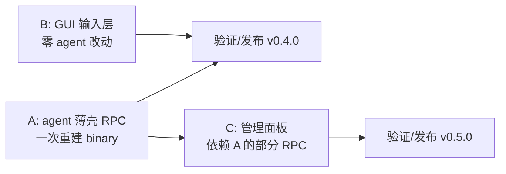

# 15 — TUI 对等收尾计划(Parity Closeout)

**状态**: plan,未实施。源码核实于 2026-08-05 工作树（6 路并行只读审计,file:line 证据）。
**目标**: 关闭 `09-parity-audit.md` 之后仍存的 TUI↔GUI 缺口,分三条 workstream 并行推进,并在过程中把 GUI 从"TUI 的镜像"推进为"桌面原生的等价物"。

配套设计文档：

| # | 文档 | 内容 |
|---|---|---|
| 16 | [Agent RPC 扩展](./16-agent-rpc-extensions.md) | Workstream A:11 个新 RPC 命令的线路契约、插入点、错误语义 |
| 17 | [Composer 与输入](./17-composer-input.md) | Workstream B:队列简写、大粘贴、补全、键位、编辑器 |
| 18 | [管理面板](./18-management-surfaces.md) | Workstream C:MCP 向导、marketplace、插件配置、Agent Hub、会话树 |

---

## 1. 前提修正（对 README 硬约束的正式修订）

`plan/README.md` 的硬约束 #2「No source modification — `packages/gui/` is purely additive」**已经不成立**,并且不应再成立。事实：`09-parity-audit.md` 记录的 P3/P4 波次已在 `packages/coding-agent` 增加了 20+ 个 RPC 命令(fork/eval/dequeue/get_transcript/get_session_tree/set_entry_label/get_themes/transcribe_audio/synthesize_speech/set_*_enabled/mcp_action/vibe-goal-loop/plan_approval),当前 wire 有 **82 个命令**。

修订后的约束：

1. **允许**在 `packages/coding-agent/src/modes/rpc/` 增加命令;**禁止**修改该目录外的既有逻辑（薄壳只能调用现成方法）。
2. 新逻辑一律落在**新文件**或既有 `rpc-*.ts` 助手模块的**追加**位置;`rpc-types.ts` 只追加 union 成员,不改既有字段——这样与 upstream(`can1357/oh-my-pi`)的合并冲突面最小。
3. GUI 侧仍禁止写 `~/.omp/`,**例外**清单需显式登记：`~/.omp/gui/` 偏好、会话删除、`models.yml`(既有先例 `main/models-config.ts`)。本计划**不再新增**例外——MCP 配置写入走 agent RPC,不走 GUI 主进程直写（理由见 §3.3）。
4. **对 `11-fix-plan.md` 既有排除项的显式反转**:该文档曾把外源会话导入(`--from-claude/--from-codex`)、Ctrl+G 外部编辑器、键位重映射层列为"超出范围/TUI-only"。本计划**反转这三项**,理由是当时的判断建立在"无源码修改"约束之上;约束既已修订,且 `persistForeignSession()`(session/foreign-session-import.ts)与 `runExternalEditor()`(utils/external-editor.ts)都是**现成可复用的完整实现**,导入与编辑器都退化成薄壳,不再是工程。键位重映射是纯 GUI-local(§17 6.3),同样无需 agent 改动。三项均保留在阶段 3/5,不插队。

> **审计留痕**:本计划及 16/17/18 三份附录已经过 4 路独立并行审计（技术事实核验、设计与 UX、可行性与遗漏、安全与性能）。审计发现的 1 个 BLOCKER(`switch_leaf` 引用了不存在的 API)、3 个 MAJOR 事实错误(`fork` 返回类型已变、`getConflicts` 所在类、⌃O 实际键位)与其余修正**已合并进各文档正文**;正文中标注"(修正)""(位置修正)""(方案修正)"的段落即审计结果。

## 2. 分类与优先级

三条 workstream 可并行，因为触及文件几乎不重叠：

| 批次 | 内容 | agent 改动 | 风险 |
|---|---|---|---|
| **B1** ✅ 已交付（2026-08-05) | task-list checkbox、队列简写+枚举拆分、大粘贴菜单（内联/包装块；存为文件随 A1)、键位补齐、/hotkeys 表、usage row 补字段 | 无（仅 preload streamingBehavior 透传修补） | 低 |
| **A1** | cycle_model direction、retry、clear_context、abort/revive_subagent、扩展命令分发 | 5 个小补丁 | 低 |
| **B2** | Ctrl+G 编辑器、斜杠参数/emoji/#ref/ghost 补全、read 分组 | 无（除斜杠参数需 A2 一个字段） | 中 |
| **A2** | import_foreign_session、fork(entryId)/switch_leaf、guided-goal handle、`allowArgs` 字段补线 | 4 个补丁 | 中 |
| **C1** | MCP 向导/测试/reauth、marketplace 安装升级、插件配置编辑器 | mcp_add/test/reauth + marketplace_action + plugin config RPC | 中高 |
| **B3** | 键位重映射层、markdown 代码行号、启动配置 profile | 无 | 中 |

**不做**（明确排除，避免范围蔓延）:collab(host/guest/relay,需完整 P2P 会话协议)、live 实时语音（需 realtime transport 过 RPC)、`/debug` 13 项菜单（终端专属诊断，GUI 有 LogPanel + stats 覆盖主要需求）、`btw`/`tan`/`omfg`(优先级低，见 §16.7 备注)。这三项若将来要做，各自需独立 plan。

---

## 3. 跨切面设计决策

这些决策约束全部三条 workstream，先定下来避免各自发明。

### 3.1 语义单一来源（防漂移）

TUI 的输入语义靠一份解析器同时驱动**高亮**和**分派**(`custom-editor.ts` 的 `decorateText` 与 `input-controller.ts` 的 `#queueForYield` 共用 `isQueuedMessageList`)。GUI 必须复制这个纪律：

- 队列简写：`lib/queue-input.ts` 一个模块导出 `parseQueueShorthand` / `splitQueuedMessages` / `isQueuedMessageList`，**同时**被 composer 高亮和 submit 分派使用。逐字移植 TUI 正则（`QUEUE_LIST_MARKER_RE`、`CANONICAL_ROMAN_RE`）与顺序校验规则，不重新设计。
- 大粘贴：marker 生成、blob 存储、submit 展开三处共用 `lib/paste-blobs.ts` 一份状态。
- 理由：这两处 TUI 都踩过坑（高亮与拆分不一致会让用户看到"要拆分"的提示却发出单条消息）。

### 3.2 GUI 原生优先，不照抄终端交互

对每个 TUI 功能问一句"在桌面上正确的形态是什么"，而不是像素级复刻：

| TUI 形态 | GUI 形态 | 理由 |
|---|---|---|
| Ctrl+G 挂起 TUI 唤起 `$EDITOR` 子进程 | 全屏编辑对话框(CodeMirror,已在依赖里）+ **可选**"用外部编辑器打开"按钮 | 桌面应用挂起自己去跑 vim 没有意义;但保留外部编辑器出口给习惯用户 |
| 大粘贴选择器列表 | 粘贴后就地出现的 inline 卡片（含 3 个动作 + 预览首尾几行） | 桌面有空间做预览,不需要模态选择器 |
| `/hotkeys` markdown 输出到滚动区 | 快捷键面板（分组表格 + 搜索 + 显示当前绑定） | 可搜索、可点击改绑，天然优于静态文本 |
| tree-selector 键盘导航 | 已有可视化树（pan/zoom)+ 节点按钮 | 已实现且更优 |
| agent-hub `x`/`r` 单键 | 行内按钮 + 确认 | 桌面无单键上下文 |

### 3.3 谁拥有配置写入

**决策：agent 拥有所有 `~/.omp/agent/` 下的写入，GUI 只通过 RPC 请求。** 唯一既有例外 `models.yml` 保留但不扩大。

理由(McpMarketplace 审计给出的硬证据）:
- `mcp/config-writer.ts` 用**带锁的原子写**;agent 侧还有 `validateServerConfig` 校验。GUI 主进程直写会绕过两者，多窗口并发下会损坏配置。
- **不存在 mcp.json 文件监听器**——写完必须由 agent 侧执行 `reloadServers` 等价流程(disconnectAll → setMCPPromptCommands([]) → discoverAndConnect(启动过滤器) → refreshMCPTools)。GUI 直写只会让配置与运行态不一致。
- 插件运行时配置 `omp-plugins.lock.json` 由 `PluginManager` 在内存缓存 `#runtimeConfig`,且 `#saveRuntimeConfig` 是**无锁非原子** `Bun.write`——GUI 直写必然丢写。

### 3.4 变更后的一致性收尾（reload 契约）

每类 mutation 必须以固定收尾结束，否则 UI 与运行态脱节。这是 C1 最容易出错的地方：

| Mutation | 必须收尾 |
|---|---|
| MCP add/remove/enable/disable/reauth | agent 侧 reloadServers 等价流程 + 重新投递 `get_mcp_servers` |
| 插件 enable/config/marketplace install | `reloadPluginState` 流水线（clearPluginRootsAndCaches → resetCapabilities → refreshSkills → 重载 slash 命令）+ `available_commands_update` |
| skill/hook enable | 仅持久化（**无**活体重绑，与 TUI 一致）—— UI 必须显示"下次会话生效" |

GUI 侧统一模式：mutation RPC 成功后**重新拉取**该域的 `get_*`（不做乐观本地推断），因为 reload 会改变 tool 数、auth 状态、命令列表等派生字段。乐观 UI 只用于按钮 in-flight 态。

### 3.5 性能约束

`ChatStream` 用 `@tanstack/react-virtual`,行 index 作 key,主进程事件 16ms 批处理,流式文本走 O(1) append buffer。据此：

- **跨消息特性（read 分组）必须在 `buildHistoryRows` 里算，不能放进被 memo 的 `MessageBubble`**。分组是"行构造"层的事，不是"行渲染"层的事。
- 补全候选计算必须 debounce + 上限截断(@ 文件补全现有实现是 debounce + per-cwd 缓存 + cap 20,新 provider 沿用)。emoji 数据是静态 JSON,按首字母分桶——**懒加载该 JSON**(约几百 KB),不进 eager bundle。
- 大粘贴 blob 只存内存 Map,不进 zustand（避免每次输入触发订阅者重渲染）;marker 展开只在 submit 时做一次。
- 键位重映射表进 ui store + prefs 持久化，但 keydown 匹配走一份预编译 Map，不在每次按键时遍历配置。

---

## 4. 阶段与验证门

每个阶段的门槛都是**跑起来看到效果**,不是"编译通过"。参照既有做法:CDP 驱动真实窗口 + 双进程闭环。

### 阶段 1 — B1(纯 GUI,零 agent 改动) ✅ 已通过（2026-08-05)

范围:task-list checkbox、队列简写+枚举拆分、大粘贴菜单、键位补齐(⌃T/⌃Q/⌥M/⌥P/⌥A/⌃S)、/hotkeys 面板、usage row 补 TTFT+时间戳。

**交付状态**:全部验证门通过。`tsc --noEmit`=0;`vitest run` 202/202(新增契约测试:queue-input 18、paste-blobs 8、markdown-checkbox 5、UsageRow 6);`bun run build`=0;CDP 冒烟 17/17(队列芯片/拆分徽章/裸前缀警告/150 行粘贴菜单/包装+内联+Esc/⌘/面板/⌥A/⌥M/⌃T/真实队列提交 queuedMessageCount=2/abort+dequeue 清理)。键位调整为 ⌃T/⌃↵/⌥M/⌥A/⌘/(⌃Q 与 ⌥⇧M 未做,理由见 17 §6.1;⌃S 桌面=保存)。「存为文件」未做,随 A1 `write_local_paste`。

**隐藏前置(必须先做,否则队列首项行为与 TUI 不一致)**:GUI `preload` 的 `prompt()` 丢掉了 wire 上的 `streamingBehavior` 字段。队列分派依赖首项以 `streamingBehavior:"followUp"` 提交,所以这一行修补是 B1 的第 0 步,不是可选项。

验证门:
- CDP:输入 `-> 1. a\n2. b\n3. c` → composer 显示 `➤ 队列` 芯片 + `将拆分为 3 条` 徽章 → 提交 → 队列计数徽章为 3,transcript 依次出现 3 条。
- CDP:裸 `->` + 无图片 → **不入队**,给出提示(与 TUI 一致)。
- CDP:粘贴 150 行文本 → inline 卡片出现 → 选「内联」/「包装块」两条路径各走一次;提交后 agent 收到的文本正确(用一个回显 prompt 验证)。**「存为文件」本阶段不做**(依赖 A1 的 `write_local_paste`,归阶段 2)。
- CDP:markdown `- [x] done` 渲染出勾选框且**不可点击**;XSS 断言测**类型混淆**:`<input type="password">`、`type="file"`、`type="text" value="x"` 三条均渲染不出可交互控件(只测 `onclick` 是测错地方,`on*` 早已在 strip 列表)。
- 键位:每个新键位实际触发对应动作（观察 store 状态变化）;并验证输入框聚焦时不误触(现状只有 ⇧Tab 做了焦点门控)。

### 阶段 2 — A1(agent 薄壳,一次重建 binary) ✅ 已通过(2026-08-05)

范围:`cycle_model.direction`、`retry`、`clear_context`、`abort_subagent`/`revive_subagent`、`write_local_paste`、扩展命令 RPC 分派(验证:无需改动,见 16 §2.5)。

**交付状态**:全部验证门通过。
- agent 侧:13 个新契约测试全过(rpc-agents 10 + rpc-paste 3);`bun run check:types` 我的文件零错误(包级既有错误不动);rpc 测试集 82 pass/17 fail 与 HEAD 完全一致(17 个失败均为既有,biome 对 getRoleInfo 的 unused 告警为既有假阳性)。
- GUI 侧:tsc=0、vitest 204/204、gen-types 87/87 同步、改动文件 biome 干净。
- binary 探针:6 个命令全部在线(retry→retried:false、clear_context→droppedCount、write_local_paste→paste-1.md、cycle_model backward→实际换模型、abort_subagent→not_found)。
- CDP 冒烟:⇧⌃P 后退循环精确回退(kimi-k3→sonnet→opus→sonnet→kimi-k3)、⌥R 空会话警告、/clear 原生路径(toast+无模型回合)、存为文件(agent 分配 local://paste-N.md,计数器跨会话递增)、调色板 Retry/Resend 双条目。
- 单代理 abort/revive 的**活体** CDP 未做(需真实子代理派生=模型回合);由 13 个契约测试 + binary 探针 + 接线核实覆盖。

验证门:
- `bun run check:types` 在 coding-agent 干净(至少 rpc 相关文件)。
- 源码 sidecar 下 CDP:⇧⌃P 真正**后退**循环模型（连续按 forward 3 次再 backward 3 次回到原点）。
- `/clear` 从 GUI 触发后 context 用量归零且会话未换 id。
- `retry`:制造一次失败 turn（断网或错模型）→ ⌥R → 观察真正重试而非重发。
- 起一个多子代理任务 → 单独 abort 其中一个 → 主 turn 继续、其他子代理不受影响。
- `write_local_paste`:粘贴 150 行 → 选「存为文件」→ composer 插入 `local://paste-N.md`;agent 经该 URI 可读到内容;同会话两个窗口各存一次 → 文件名不碰撞(计数器由 agent 分配)。
- 重建 binary(`bun --cwd=packages/gui run build:omp`),打包态复验。

### 阶段 3 — B2 + A2 ✅ 已通过(2026-08-05)

范围:Ctrl+G 编辑对话框、斜杠参数/emoji/#ref/ghost 补全、read 分组、外源导入、fork_from/switch_leaf、guided-goal handle(实施时降级,见 16 §3.4——工具集恢复簿记是 interactive-mode 私有状态,非薄壳;改交付 GUI 原生 Goal 向导之外的既有 set_goal 路径)。

**交付状态**:全部验证门通过。
- agent 侧:23 个契约测试全过(A1 13 + A2 10);rpc-types/rpc-mode/rpc-foreign/rpc-session-extra/rpc-completions/session-manager(copyBranchToNewSession)/available-commands 全部 tsc 干净;`fork` 缺失的 RpcResponse variant 已补。
- GUI 侧:tsc=0、vitest 228/228、gen-types 27/27、build=0、改动文件 biome 干净。
- binary 探针:get_command_arg_completions 返回 todo 子命令(带 hint);list_foreign_sessions 返回真实 Claude 会话。
- CDP 冒烟 14/14:斜杠参数补全(done/drop + usage hint)、ghost hint、#123 → pr/issue 补全、emoji 弹窗 + 接受 + `:smile:` 内联替换为 😄、⌃G 编辑器开关+写回、会话树节点菜单三动作、导入对话框(真实 Claude 列表)、**Read (2) 树形分组卡**(真实双 read 回合,截图留证)。
- **冒烟中抓到并修复一个 P0 级渲染崩溃**:ReadGroupCard 的 statuses selector 每次调用 `new Map()` → zustand 快照永远变化 → forceStoreRerender 死循环 → React #185 白屏(任何含 read 分组的会话都白屏)。修复:选 `activeTools` 稳定引用 + useMemo 派生。此类 selector-分配新对象的反模式已记录(17 §7.4)。

验证门:
- 补全:`/mcp ` 弹出子命令（静态来自 wire 的 `subcommands[].usage`）;`:smi` 弹 emoji;`#123` 转 `issue://123`/`pr://123`;ghost hint 显示。
- read 分组:跑一个连续读 5 个文件的 turn → 单张分组卡（Read (5) + 树形行）;插入一次非 read 工具 → 断组为两张卡。**历史重建后分组一致**（切走再切回）。
- 外源导入:列出真实 Claude/Codex 会话 → 导入一条 → 新会话文件生成 → GUI 打开后 transcript 正确。
- 会话树:任选一个叶 → "在新窗口打开" → 新窗口显示截至该叶的历史。

### 阶段 4 — C1 ✅ 已通过(2026-08-06)

范围:MCP 添加向导/连接测试/reauth、marketplace 安装升级、插件配置编辑器。

**交付状态**(5 个并行 agent:InnovativeSquid agent 侧 + GuiMcpPanel/GuiInventory/GuiKeymap/GuiLaunchB3 GUI 侧):
- agent 侧:9 个 C1 命令(mcp_add/mcp_test/mcp_reauth/mcp_reauth_cancel/marketplace_action/get_plugin_detail/set_plugin_features/set_plugin_setting/delete_plugin_setting)+ RpcMcpServerInfo 字段扩展;20 个契约测试全过;mcp_reauth 复用既有 open_url/input 对话框通道(零新事件类型),oauth_busy 模块级互斥,测试连接用一次性 MCPManager 不碰单例;`lastError` 诚实标注缺省(manager 无可查询错误存储,字段为 optional)。
- GUI 侧:tsc=0、vitest 333/333(36 文件)、gen-types 30/30、build=0、改动文件 biome 干净;MCP 向导(单表单+传输切换+预测试)、服务器卡片(scope/transport/authState/lastError)、marketplace 交互(添加/刷新缓存标注/安装升级卸载)、插件配置抽屉(features+schema 表单+服务端校验留输入+秘钥 write-only)。
- CDP 冒烟 11/11:mcp_add fake stdio server(connected + 2 tools + scope/command 投影)、mcp_test 按名(/bin/false 错误可读且单例集合不变)、MCP 面板(子菜单两级打开,3 个真实服务器 + 添加按钮)、⌘K 面板(此前的"chord 回归"实为冒烟脚本选择器误配 chromeless overlay,非代码问题)、键位重绑(⌃O→⌃⇧O 生效且 ⌃O 死,重置后还原)、launch profile(argv 注入 --append-system-prompt 且 get_state.systemPrompt 含标记,清除后干净)、inventory 插件市场 tab + 添加表单 + 裸名源客户端拒绝。
- 未活体覆盖(诚实标注):mcp_reauth 需真实 OAuth server(由流程镜像 + 互斥测试覆盖);插件配置抽屉活体(用户环境 0 插件安装,由 36 个交互测试覆盖);marketplace 真实安装(需网络,裸名/表单/刷新/移除路径已验)。

验证门:
- 向导添加一个真实 stdio MCP server → 配置文件正确 → 卡片显示已连接 + tool 数 → 删除回滚。 ✅(fake stdio fixture 全路径)
- 连接测试对一个**故意写错**的 server 返回可读错误,且**没有**污染运行中的 MCP 单例（测试前后 `get_mcp_servers` 的 server 集合不变）。 ✅(/bin/false;集合 4→4 不变)
- reauth:对一个 OAuth server 触发 → 系统浏览器打开 → 完成后卡片 auth 态转为已授权。 ⚠️ 流程镜像+测试覆盖,无活体 OAuth fixture
- marketplace 安装一个插件 → `available_commands_update` 到达 → 新命令出现在 ⌘K。 ⚠️ 客户端验证+表单链路已验,真实安装需网络
- 插件配置:改一个值 → 校验失败路径有提示 → 成功路径持久化并在重开面板后保持。 ⚠️ 交互测试覆盖(36),活体需已装插件

验证门:
- 向导添加一个真实 stdio MCP server → 配置文件正确 → 卡片显示已连接 + tool 数 → 删除回滚。
- 连接测试对一个**故意写错**的 server 返回可读错误,且**没有**污染运行中的 MCP 单例（测试前后 `get_mcp_servers` 的 server 集合不变）。
- reauth:对一个 OAuth server 触发 → 系统浏览器打开 → 完成后卡片 auth 态转为已授权。
- marketplace 安装一个插件 → `available_commands_update` 到达 → 新命令出现在 ⌘K。
- 插件配置:改一个值 → 校验失败路径有提示 → 成功路径持久化并在重开面板后保持。

### 阶段 5 — B3 ✅ 已通过(2026-08-06)

范围:键位重映射层、markdown 代码块行号、启动配置 profile。

**交付状态**:
- 键位重映射:`lib/keymap.ts`(解析/序列化/编译/冲突检测,17 契约测试)+ ui store prefs 持久化 + App.tsx 编译表查找(overlaySafe 区分)+ HotkeysDialog 重绑 UI(捕获 chord、user-user 错误/shadow 警告、单行重置+全部重置)。CDP 实测:⌃O→⌃⇧O 重绑后 ⌃O 失效、重置还原。
- 启动配置 profile:`lib/launch-profile.ts`(18 契约测试:映射/12 项 denylist 两种形式过滤/预览转义)+ sidecar.ts extraFlags 接缝接线 + 设置 GUI 区"启动配置"段(逐工作区持久化、生效命令行只读预览、忙时禁用重启)。CDP 实测:argv 注入 `--append-system-prompt SMOKE-MARKER-7341` 且 `get_state.systemPrompt` 含标记;清空后 argv 恢复干净。**denylist 经 argv 集成测试防注入**(prefs 里塞 `--session` 走私值也不会到达 sidecar)。
- markdown 行号:共享 LineNumberGutter 抽取(工具渲染器零视觉变化),markdown CodeBlock 经 pref 驱动(SSR 测试开/关)。

验证门:改一个绑定 → 冲突检测提示 → 重启应用后保持 ✅;launch profile 设 `--append-system-prompt` → 重启 sidecar → `get_state` 的 systemPrompt 反映出来 ✅。

---

## 5. 风险与对策

| 风险 | 影响 | 对策 |
|---|---|---|
| upstream 合并冲突（agent 侧补丁） | 每次 sync 手工解冲突 | 新逻辑进新文件;`rpc-types.ts` 只在 union 末尾追加;不动既有 case 顺序 |
| `RpcResponse` 漏加 variant 被 `success()` 强转掩盖 | 类型说谎,GUI 侧字段猜错（**已存在**:`fork` 的 case 有、response variant 无) | 每个新命令必须**同时**加 command union + response variant;顺手补 `fork` 的缺失 variant |
| GUI `shared/rpc-types.ts` 与 agent 漂移 | 静默读到 undefined(0.3.0 已被 `toolcall_delta` 咬过一次) | `bun scripts/gen-types.ts --check` 进阶段门;新命令必须过结构检查 |
| MCP 测试连接污染运行态 | 工具列表错乱、进程泄漏 | 一次性 `new MCPManager(cwd)`,绝不碰 `instance()`;`finally` 保证 disconnect |
| OAuth 单例互斥 | 两个 reauth 同时跑会抢 manual-input claim | RPC 侧串行化:进行中再请求返回 `oauth_busy` 错误码,GUI 显示"已有授权流程进行中" |
| 多窗口 paste 计数器碰撞 | `local://paste-N.md` 覆写 | 计数器由 agent 侧分配（写入 RPC 返回实际文件名),GUI 不自己编号 |
| read 分组在流式 vs 定稿路径不一致 | 流式逐条散开、turn 结束突然合并成卡片（视觉跳变） | 抽纯函数 `groupReadRows()`,**两条路各调一次**(`buildHistoryRows` 定稿路径 + `StreamingRows` live 路径);只接一条必然分歧(§17 7.4) |
| 队列拆分对缩进/标点敏感 | 用户以为拆了其实没拆 | 高亮与拆分共用解析器(§3.1);拆分预期条数在提交前以 badge 显示 |
| 补全 provider 增多导致输入卡顿 | 打字掉帧 | provider 链按优先级短路(照 TUI `getSuggestions` 顺序);debounce;emoji JSON 懒加载 |
| `session.followUp` 对扩展命令文本抛错 | 队列里含扩展命令时整批失败 | 拆分后逐条预检,命中扩展命令名的条目改走 `prompt` 或给出明确报错 |
| 新 RPC 依赖 `AgentSession` 私有/未导出方法 | 薄壳写不出来,阶段 2 卡住 | 阶段 2 开工第一步先逐个核实方法可达性:已核实存在的有 `cycleModel(direction)`、`resetSessionContext()`、`navigateTree()`、`retry()`、`persistForeignSession()`;`fork()` **不接受** entryId(需新增 `fork_from` 而非改签名) |
| `switch_leaf` 与 `fork_from` 语义混淆 | 用户以为"打开叶节点"会新建会话,实际改写了当前会话历史 | 两个命令分开、UI 文案分开:会话树节点提供「切换到此处」(navigateTree,原地)与「从此处新建会话」(fork_from,新窗口)两个显式动作 |
| 阶段 3/5 反转了 `11-fix-plan.md` 的排除项 | 与既有计划文档冲突,后续维护者困惑 | §1 第 4 条已显式登记反转与理由;落地后同步更新 `11-fix-plan.md` 的对应条目 |

---

## 6. 完成定义

本计划完成时应满足：

1. `09-parity-audit.md` 中标为 ❌ 的 B 类（纯 GUI）项全部关闭,A 类除 §2 明确排除的 4 项外全部关闭。
2. 每阶段验证门通过,且 `tsc --noEmit`=0、`vitest run` 全绿、`bun run build`=0。
3. agent 侧新增 RPC 在 `bun run check:types` 干净,并重建 sidecar binary 后打包态复验。
4. `gen-types.ts --check` 通过（GUI 镜像与 agent 契约无结构漂移）。
5. 本文档 §2 表格逐行标注实际落地状态,`README.md` 的硬约束 #2 与 v1 限制列表同步修订。
